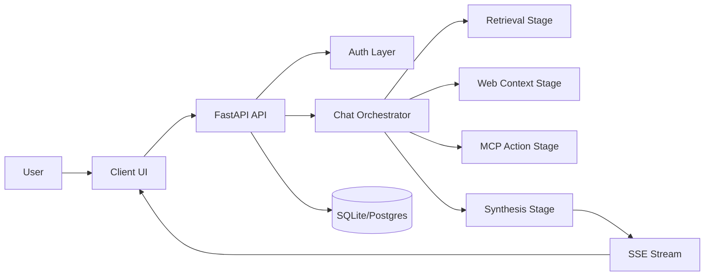
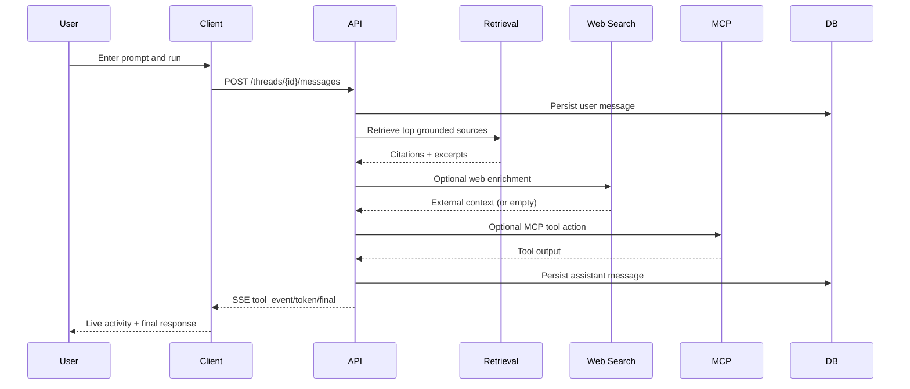
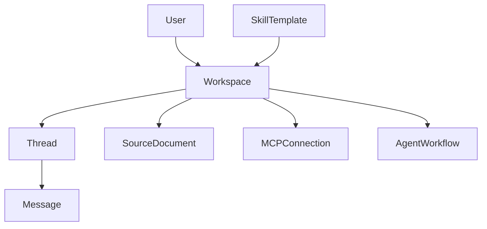

# Niche

Niche is an agentic workspace where you can ground answers in your own sources, run MCP actions, and orchestrate repeatable workflows from one terminal-first interface.

## Table of Contents

- [Walkthrough](#walkthrough)
- [What Niche Is (Non-Technical)](#what-niche-is-non-technical)
- [Core Capabilities](#core-capabilities)
- [Tech Stack](#tech-stack)
- [System Design](#system-design)
- [API Catalog](#api-catalog)
- [Data Schema Flow](#data-schema-flow)
- [Project Structure](#project-structure)
- [Local Setup](#local-setup)
- [Environment Variables](#environment-variables)
- [End-to-End Usage Flow](#end-to-end-usage-flow)
- [Verification Checklist](#verification-checklist)
- [Troubleshooting](#troubleshooting)
- [References](#references)

## Walkthrough

Add your own walkthrough media file here when ready.

## What Niche Is (Non-Technical)

If ChatGPT is a smart assistant, Niche is your operations room.  
You bring your own context (docs, links, workflows), and Niche turns it into a guided decision flow: what matters, what is risky, what should happen next, and which tools should run. Instead of jumping across tabs and tools, you stay in one place and move from question to action with a clear audit trail.

## Core Capabilities

- Authenticated user sessions via OAuth or development tokens.
- Workspace and thread context for persistent conversational state.
- Source ingestion (`text` and `url`) for grounded responses.
- MCP connection lifecycle: connect, discover tools, invoke actions.
- Skill catalog and install flow for reusable behaviors.
- Workflow create/run path for repeatable execution.
- Streaming orchestration events (`tool_event`, `token`, `final`) into the UI.

## Tech Stack

### Server

- **Framework:** FastAPI
- **Data layer:** SQLAlchemy ORM + Pydantic schemas
- **Auth:** JWT + OAuth provider flows
- **Retrieval:** source scoring via lightweight keyword matching
- **Tool runtime:** MCP HTTP adapter (`/tools`, `/invoke`)
- **Streaming:** Server-Sent Events (SSE)

### Client

- **Framework:** React + TypeScript + Vite
- **Interaction model:** terminal-first command and activity panels
- **State model:** workspace/thread/resource/tool/workflow state in one app shell
- **Transport:** REST + streaming fetch for chat orchestration

### Data + Runtime

- **Default local DB:** SQLite (`niche.db`)
- **Container option:** Postgres/pgvector via Docker Compose
- **Operational configs:** Nginx + systemd definitions under `system/`

## System Design

### Runtime Logic Design



### Chat Sequence (Request to Streamed Result)



## API Catalog

All core endpoints are under `/api/v1` unless noted.

### Auth

- `POST /auth/dev-token`
- `GET /auth/me`
- `GET /auth/oauth/google/start`
- `GET /auth/oauth/github/start`
- `GET /auth/oauth/{provider}/callback`

### Workspaces + Threads

- `GET /workspaces`
- `POST /workspaces`
- `GET /workspaces/{workspaceId}`
- `GET /workspaces/{workspaceId}/threads`
- `POST /workspaces/{workspaceId}/threads`
- `GET /workspaces/{workspaceId}/threads/{threadId}/messages`
- `POST /workspaces/{workspaceId}/threads/{threadId}/messages` (SSE)

### Sources

- `GET /workspaces/{workspaceId}/sources`
- `POST /workspaces/{workspaceId}/sources`
- `POST /workspaces/{workspaceId}/sources/upload`

### MCP

- `GET /workspaces/{workspaceId}/mcp/connections`
- `POST /workspaces/{workspaceId}/mcp/connections`
- `POST /workspaces/{workspaceId}/mcp/connections/{connectionId}/discover`
- `POST /workspaces/{workspaceId}/mcp/connections/{connectionId}/invoke`

### Skills + Workflows

- `GET /skills/catalog`
- `POST /skills/install`
- `GET /workspaces/{workspaceId}/agents/workflows`
- `POST /workspaces/{workspaceId}/agents/workflows`
- `POST /workspaces/{workspaceId}/agents/workflows/{workflowId}/run`

### Operational

- `GET /health`
- `GET /metrics`

## Data Schema Flow

Primary entities and relationships:



### Core Tables

- `users`: identity, provider metadata
- `workspaces`: user-owned project context
- `threads`: per-workspace conversation streams
- `messages`: user/assistant content + citations + tool events
- `source_documents`: ingested text/url content
- `mcp_connections`: MCP endpoints and discovered tools
- `agent_workflows`: reusable step definitions
- `skill_templates`: installable skill catalog

## Project Structure

- `server/` API routes, models, services, worker stubs
- `src/` UI, API client, styling, and terminal UX logic
- `system/` Docker Compose, Nginx, and systemd deployment artifacts
- `.github/workflows/` CI workflow definitions

## Local Setup

### 1) Copy environment template

```bash
cp .env.example .env
```

### 2) Start dependencies (optional for Postgres mode)

```bash
docker compose -f system/docker-compose.yml up -d postgres
```

If Docker is not running, server defaults to SQLite.

### 3) Start server

```bash
cd server
python -m venv .venv
source .venv/bin/activate
pip install -r requirements.txt
uvicorn app:app --reload --port 8100
```

### 4) Start client

```bash
cd src
npm install
npm run dev
```

- Client URL: `http://localhost:5173`
- Server health: `http://127.0.0.1:8100/health`

### 5) Get a development token

```bash
curl -X POST "http://localhost:8100/api/v1/auth/dev-token?email=dev@niche.com&name=Niche%20Dev"
```

## Environment Variables

- `NICHE_ENV`
- `NICHE_API_PORT`
- `NICHE_FRONTEND_ORIGIN`
- `NICHE_DATABASE_URL`
- `NICHE_JWT_SECRET`
- `NICHE_JWT_EXPIRES_MINUTES`
- `NICHE_GOOGLE_CLIENT_ID`
- `NICHE_GOOGLE_CLIENT_SECRET`
- `NICHE_GITHUB_CLIENT_ID`
- `NICHE_GITHUB_CLIENT_SECRET`
- `NICHE_OAUTH_REDIRECT_BASE`
- `NICHE_RATE_LIMIT_PER_MINUTE`

Client session storage key: `niche-token`.

## End-to-End Usage Flow

1. Save a bearer token in the client.
2. Create/select workspace and thread.
3. Add grounded sources (text/url).
4. Discover MCP tools and invoke actions.
5. Install a skill from catalog.
6. Run a workflow.
7. Submit prompt and watch activity + streamed response with citations.

## Verification Checklist

```bash
# client build
cd src && npm run build

# server syntax checks
cd ../server && source .venv/bin/activate && python -m compileall .

# server health
curl http://127.0.0.1:8100/health
```

Recommended smoke checks:

- auth token + `/auth/me`
- workspace/thread create + reload
- source ingest (text + url)
- MCP discover + invoke
- skill install
- workflow run
- chat SSE stream

## Troubleshooting

### Server on `8100` not reachable

- Confirm `uvicorn` is running in `server/`.
- Check `.env` values, especially `NICHE_DATABASE_URL`.
- If using Postgres mode, ensure Docker service is up.

### Client on `5173` not reachable

- Restart `npm run dev` in `src/`.
- Check for port conflicts (`5173` in use by another process).

### Token saves but UI shows `User not found`

- Generate a fresh token after DB resets.
- Clear stale local token:
  - `localStorage.removeItem("niche-token")`

### MCP discover/invoke issues

- Validate MCP endpoint responds on `/tools` and `/invoke`.
- Re-run discover before invoke to refresh tool list.
- Check activity log lines for stage-by-stage error details.

## References

- Model Context Protocol (latest spec): [modelcontextprotocol.io/specification/latest](https://modelcontextprotocol.io/specification/latest)
- Model Context Protocol (GitHub org): [github.com/modelcontextprotocol](https://github.com/modelcontextprotocol)
- JSON-RPC 2.0 (protocol basis for MCP): [jsonrpc.org/specification](https://www.jsonrpc.org/specification)
- RAG foundational paper (Lewis et al., 2020): [arxiv.org/abs/2005.11401](https://arxiv.org/abs/2005.11401)
- RAG survey (Gao et al., 2023): [arxiv.org/abs/2312.10997](https://arxiv.org/abs/2312.10997)
